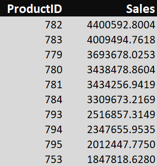
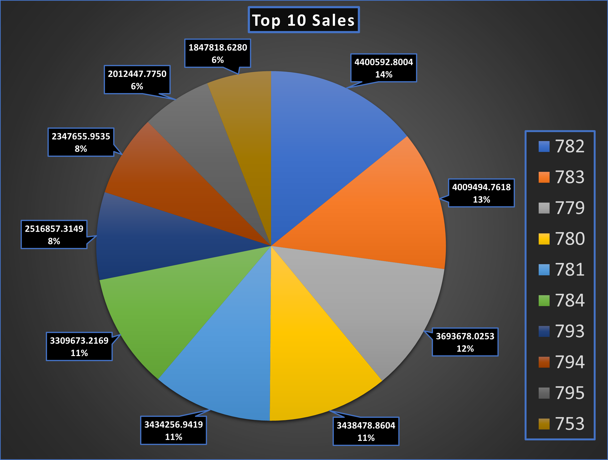

# SQL Project - Business Analysis

A comprehensive analysis of business data using SQL queries to solve critical problem statements.

## Table of Contents
- [Overview](#overview)
- [Deliverables](#Deliverables)
- [Problem Statements](#Problem-Statements)
- [Presentation and Findings](#Presentation-and-Findings)

## Overview

Here is the sql to calculate the provided problem and the data output screenshots.


## Deliverables

The project's deliverables include the following:

- **SQL Query File**: Contains the SQL queries used to generate data for solving each problem statement.
- **OUTPUT**: OUTPUT TABLE.
- **PIE CHART**: PIE CHART.

## Problem Statements

### 1. Top 10 Highest Selling Products
**Problem Statement:** Determine the top 10 highest selling products in the database using the `salesorderdetail` table and `LineTotal` as sales. Create a Pie chart to visualize this information.

**Explanation of Code:** 

```sql
-- SQL Query for Problem Statement 1
#Select Database
use adventureworks;
SELECT
#Select table fields ProductID and sum of LineTotal for each ProductID
ProductID,
round(sum(LineTotal), 4) as Sales
#Define the Source Table
FROM adventureworks.salesorderdetail
#Partioning the table for each ProductID
group by ProductID
#Arrange all data in descending order of Sales
order by Sales desc 
#Show top 10 rows only
limit 10;
```

## Presentation and Findings

THE TABLE OF OUTPUT DATA



THE PIE CHART CREATED WITH OUTPUT DATA


