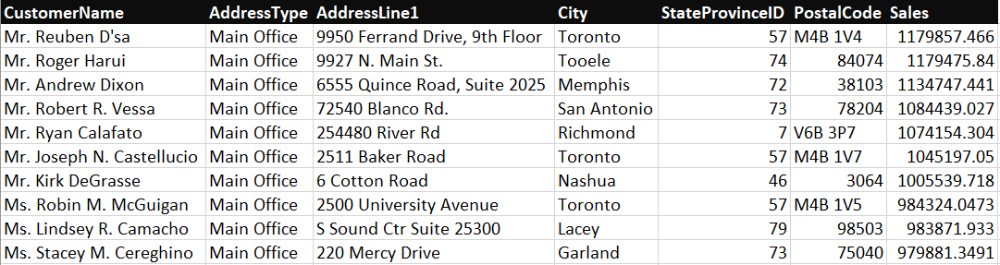
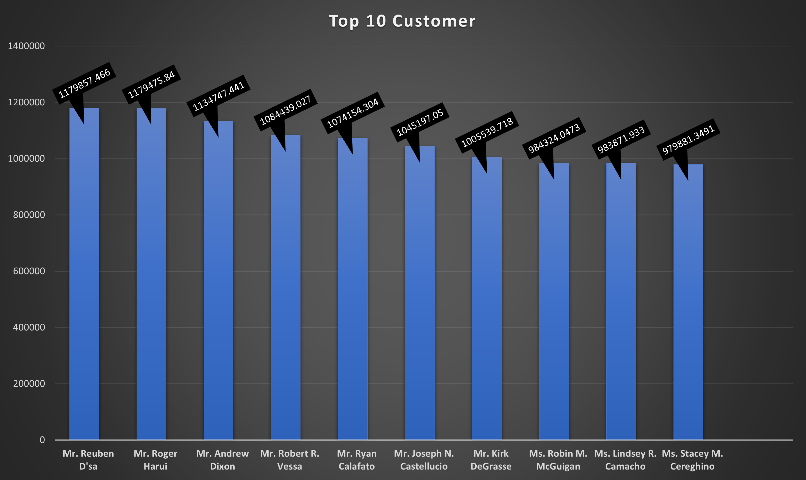

# SQL Project - Business Analysis

A comprehensive analysis of business data using SQL queries to solve critical problem statements.

## Table of Contents
- [Overview](#overview)
- [Deliverables](#Deliverables)
- [Problem Statements](#Problem-Statements)
- [Explanation of Code](#Explanation-of-Code)
- [Presentation and Findings](#Presentation-and-Findings)
- [Navigation](#Navigation)


## Overview

Here is the sql to calculate the provided problem and the data output screenshots.


## Deliverables

The project's deliverables include the following:

- **SQL Query File**: Contains the SQL queries used to generate data for solving each problem statement.
- **OUTPUT**: OUTPUT TABLE.
- **BAR CHART**: BAR CHART.

## Problem Statements

### Top 10 Highest Spending Customers
**Problem Statement:** Who are the top 10 highest spending customers in the data along with their
address and address type information?
(Hint - Use salesorderheader as base table, TotalDue as sales)
Create a Bar chart to depict this information.

## Explanation of Code 

```sql
-- SQL Query for Problem Statement 2
##Select Database
use adventureworks;

##Get all fields from Tables
select

##To Generate Customer Name We used concat_ws function which has seperator value ' ' and all other fields
##insted of concat function as there are some null fields
concat_ws(' ', contact.Title, contact.FirstName,contact.MiddleName,contact.LastName) as CustomerName, 

##All fields of customer's address
addresstype.Name as AddressType, address.AddressLine1, address.City, address.StateProvinceID,  address.PostalCode,

##Total sale per customer, we used sum to add all values and used round function to get 4 digits after decimal point 
round(sum(salesorderheader.TotalDue), 4) as Sales

##Choose our base table
from salesorderheader

##Joining all other tables required to get all details
join customeraddress on salesorderheader.CustomerID = customeraddress.CustomerID
join address on customeraddress.AddressID = address.AddressID
join addresstype on customeraddress.AddressTypeID = addresstype.AddressTypeID
join Contact on Contact.ContactID=salesorderheader.ContactID

##Grouping all fields as per our requirement
group by CustomerName, AddressType, AddressLine1, City, StateProvinceID, PostalCode

##As we need maximum sales so we sorted our data from higher to lower sale amount
order by Sales desc

##We just need top 10 data so we limited our table for only top 10
limit 10;
```

## Presentation and Findings

THE TABLE OF OUTPUT DATA



THE BAR CHART CREATED WITH OUTPUT DATA




## Navigation

[Main Page](https://github.com/Plotted-Digit/SQL-Project/) &emsp; [1st Problem](https://github.com/Plotted-Digit/SQL-Project/tree/main/QUESTION_1) &emsp; [2nd Problem](https://github.com/Plotted-Digit/SQL-Project/tree/main/QUESTION_2) &emsp; [3rd Problem](https://github.com/Plotted-Digit/SQL-Project/tree/main/QUESTION_3) &emsp; [4th Problem](https://github.com/Plotted-Digit/SQL-Project/tree/main/QUESTION_4) &emsp; [5th Problem](https://github.com/Plotted-Digit/SQL-Project/tree/main/QUESTION_5) &emsp; [6th Problem](https://github.com/Plotted-Digit/SQL-Project/tree/main/QUESTION_6) &emsp; [7th Problem](https://github.com/Plotted-Digit/SQL-Project/tree/main/QUESTION_7)
