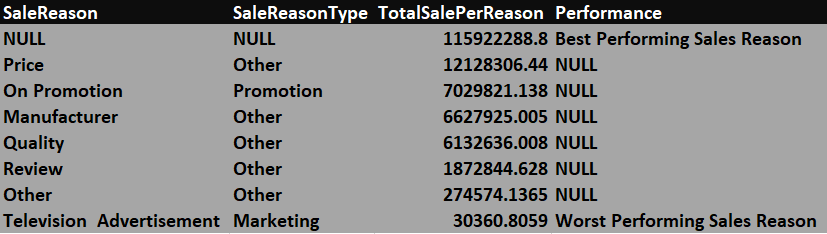
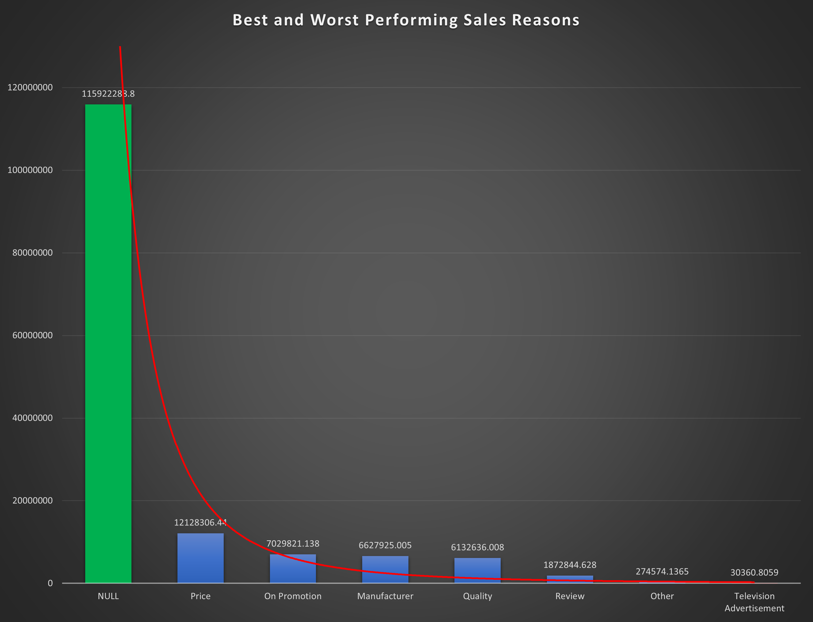
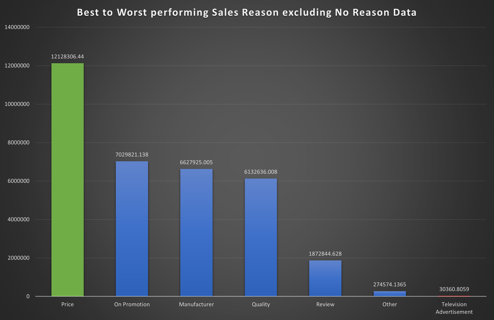

# SQL Project - Business Analysis

A comprehensive analysis of business data using SQL queries to solve critical problem statements.

## Table of Contents
- [Overview](#overview)
- [Deliverables](#Deliverables)
- [Problem Statements](#Problem-Statements)
- [Explanation of Code](#Explanation-of-Code)
- [Presentation and Findings](#Presentation-and-Findings)
- [Navigation](#Navigation)


## Overview

Here is the sql to calculate the provided problem and the data output screenshots.


## Deliverables

The project's deliverables include the following:

- **SQL Query File**: Contains the SQL queries used to generate data for solving each problem statement.
- **OUTPUT**: OUTPUT TABLE.
- **BAR CHART**: BAR CHART.

## Problem Statements

### Performance of sales for each sale reason
**Problem Statement:** Calculate the Sales by Sales Reason Name and Reason Type. Also find the
best and worst performing Sales Reason in terms of Sales
(Hint - Use salesorderheader as base table, TotalDue as sales)
Create a Bar chart to depict this information.

## Explanation of Code 

```sql
-- SQL Query for Problem Statement 3
#Select Database
use adventureworks;

#Make a temp table from the existing tables
with TempTable as(

#Select required columns from required tables
SELECT salesorderheadersalesreason.SalesReasonID, salesreason.Name, salesreason.ReasonType,
round(sum(salesorderheader.TotalDue), 4) as Sales

#Select base table
FROM salesorderheader

#Do required joins for retiving data from another tables
left join salesorderheadersalesreason on  salesorderheader.SalesOrderID =  salesorderheadersalesreason.SalesOrderID
left join salesreason on salesorderheadersalesreason.SalesReasonID = salesreason.SalesReasonID

#Group data as per requirement
group by SalesReasonID

#Make a table with proper order of Sale amount
order by Sales desc)

#Now Make the final potput from previous temp table
select Name as SaleReason, ReasonType as SaleReasonType, Sales as TotalSalePerReason,

#As we need to calculate the best and worst performing Sales Reason
#We create a new column where we put some description as per performance
case
when Sales = (select max(Sales) from TempTable) then "Best Performing Sales Reason"
when Sales = (select min(Sales) from TempTable) then "Worst Performing Sales Reason"

#We just need the best and worst performing sales Reason so we filled other fields with null
else null
end

#The name of the new created colums is provided here
as Performance

#Selecting the TempTable as source table which we generater Previously
 from TempTable 
 
 #Ordered the table data as per the Sale amount
order by Sales desc;
```

## Presentation and Findings

THE TABLE OF OUTPUT DATA



THE BAR CHART CREATED WITH BEST AND WORST PERFORMING SALES REASONS INCLUDING NO REASON DATA



THE BAR CHART CREATED WITH BEST TO WORST PERFORMING SALES REASON EXCLUDING NO REASON DATA




## Navigation

[Main Page](https://github.com/Plotted-Digit/SQL-Project/) &emsp; [1st Problem](https://github.com/Plotted-Digit/SQL-Project/tree/main/QUESTION_1) &emsp; [2nd Problem](https://github.com/Plotted-Digit/SQL-Project/tree/main/QUESTION_2) &emsp; [3rd Problem](https://github.com/Plotted-Digit/SQL-Project/tree/main/QUESTION_3) &emsp; [4th Problem](https://github.com/Plotted-Digit/SQL-Project/tree/main/QUESTION_4) &emsp; [5th Problem](https://github.com/Plotted-Digit/SQL-Project/tree/main/QUESTION_5) &emsp; [6th Problem](https://github.com/Plotted-Digit/SQL-Project/tree/main/QUESTION_6) &emsp; [7th Problem](https://github.com/Plotted-Digit/SQL-Project/tree/main/QUESTION_7)
