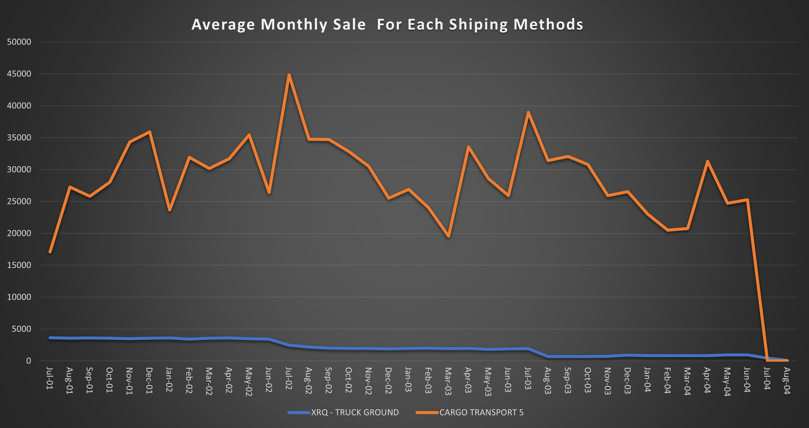

# SQL Project - Business Analysis

A comprehensive analysis of business data using SQL queries to solve critical problem statements.

## Table of Contents
- [Overview](#overview)
- [Deliverables](#Deliverables)
- [Problem Statements](#Problem-Statements)
- [Explanation of Code](#Explanation-of-Code)
- [Presentation and Findings](#Presentation-and-Findings)
- [Navigation](#Navigation)


## Overview

Here is the sql to calculate the provided problem and the data output screenshots.


## Deliverables

The project's deliverables include the following:

- **SQL Query File**: Contains the SQL queries used to generate data for solving each problem statement.
- **OUTPUT**: OUTPUT TABLE.
- **BAR CHART**: BAR CHART.

## Problem Statements

### Avarage number of order for each shipping method
**Problem Statement:** Calculate the average number of orders shipped by different Ship methods for
each month and year
(Hint - Use salesorderheader as base table, TotalDue as sales)
Create a Line chart to depict this information.

## Explanation of Code 

```sql
-- SQL Query for Problem Statement 4
#Select Database
use adventureworks;

#Create Temp Table to run future query on it
with

#This table is to group all sales for each shipping method
temptable as(
SELECT shipmethod.ShipMethodID as Id, shipmethod.Name as ShipMethod, year(ShipDate) as Year,
month(ShipDate) as Month, round(sum(TotalDue)/count(salesorderheader.ShipMethodID), 4) as AverageSale
FROM adventureworks.salesorderheader 
left join shipmethod on salesorderheader.ShipMethodID = shipmethod.ShipMethodID
group by Year, month, Id, ShipMethod
order by Id, ShipMethod, Year, month),

#This table is to extract all sales for 1st type of shipping method
ship1 as (select ShipMethod, Year, Month, AverageSale from temptable where Id = 1),

#This table is to extract all sales for 2nd type of shipping method
ship2 as (select ShipMethod, Year, Month, AverageSale from temptable where Id = 5)

#As full join isnt working we did an union of left and right join to get our required output
#We arranged all sales for each shipping method side by side according to the month and year
select ship1.Year, ship1.Month, concat_ws('/', ship1.Month, ship1.Year ) as FullDate, ship1.ShipMethod,
ship1.AverageSale, ship2.ShipMethod, ship2.AverageSale
from ship1 left join ship2 on ship1.Year = ship2.Year and ship1.Month = ship2.Month
union
select ship1.Year, ship1.Month, concat_ws('/', ship1.Month, ship1.Year ) as FullDate, ship1.ShipMethod,
ship1.AverageSale, ship2.ShipMethod, ship2.AverageSale
from ship1 right join ship2 on ship1.Year = ship2.Year and ship1.Month = ship2.Month
order by Year, month
;
```

## Presentation and Findings

THE TABLE OF OUTPUT DATA


THE BAR CHART CREATED WITH OUTPUT DATA




## Navigation

[Main Page](https://github.com/Plotted-Digit/SQL-Project/) &emsp; [1st Problem](https://github.com/Plotted-Digit/SQL-Project/tree/main/QUESTION_1) &emsp; [2nd Problem](https://github.com/Plotted-Digit/SQL-Project/tree/main/QUESTION_2) &emsp; [3rd Problem](https://github.com/Plotted-Digit/SQL-Project/tree/main/QUESTION_3) &emsp; [4th Problem](https://github.com/Plotted-Digit/SQL-Project/tree/main/QUESTION_4) &emsp; [5th Problem](https://github.com/Plotted-Digit/SQL-Project/tree/main/QUESTION_5) &emsp; [6th Problem](https://github.com/Plotted-Digit/SQL-Project/tree/main/QUESTION_6) &emsp; [7th Problem](https://github.com/Plotted-Digit/SQL-Project/tree/main/QUESTION_7)
