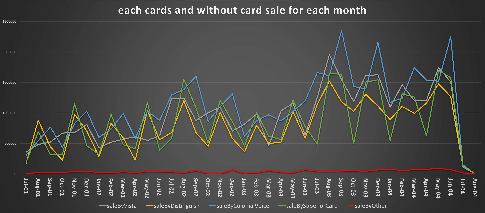

# SQL Project - Business Analysis

A comprehensive analysis of business data using SQL queries to solve critical problem statements.

## Table of Contents
- [Overview](#overview)
- [Deliverables](#Deliverables)
- [Problem Statements](#Problem-Statements)
- [Explanation of Code](#Explanation-of-Code)
- [Presentation and Findings](#Presentation-and-Findings)
- [Navigation](#Navigation)


## Overview

Here is the sql to calculate the provided problem and the data output screenshots.


## Deliverables

The project's deliverables include the following:

- **SQL Query File**: Contains the SQL queries used to generate data for solving each problem statement.
- **OUTPUT**: OUTPUT TABLE.
- **BAR CHART**: BAR CHART.

## Problem Statements

### Sale Performance of all Card Type
**Problem Statement:** Calculate the count of orders, maximum and minimum shipped by different
Credit Card Type for each month and year
(Hint - Use salesorderheader as base table, TotalDue as sales)
Create a chart as per your choice to depict this information.

## Explanation of Code 

```sql
-- SQL Query for Problem Statement 5
#Select Database
use adventureworks;

#generate a customized temp table to gather all require data from database
with baseTable as (
SELECT year(salesorderheader.ShipDate) as year, month(salesorderheader.ShipDate) as month,
concat_ws('-', monthname(salesorderheader.ShipDate), year(salesorderheader.ShipDate)) as fullDate,
round(sum(salesorderheader.TotalDue), 4) as totalSale,
count(salesorderheader.SalesOrderID) as orderCount,
creditcard.CardType as cardType
FROM adventureworks.salesorderheader
left join creditcard on salesorderheader.CreditCardID = creditcard.CreditCardID
group by year, month, fullDate, cardType
order by year, month, fullDate, totalSale desc
),

allCardSale as(
select fullDate,
max(case when cardType= 'Vista' then orderCount end) as NoOfsaleByVista,
max(case when cardType= 'Vista' then totalSale end) as saleByVista,
max(case when cardType= 'Distinguish' then orderCount end) as NoOfsaleByDistinguish,
max(case when cardType= 'Distinguish' then totalSale end) as saleByDistinguish,
max(case when cardType= 'ColonialVoice' then orderCount end) as NoOfsaleByColonialVoice,
max(case when cardType= 'ColonialVoice' then totalSale end) as saleByColonialVoice,
max(case when cardType= 'SuperiorCard' then orderCount end) as NoOfsaleBySuperiorCard,
max(case when cardType= 'SuperiorCard' then totalSale end) as saleBySuperiorCard,
max(case when cardType is null then orderCount end) as NoOfsaleByOther,
max(case when cardType is null then totalSale end) as saleByOther
from baseTable group by fullDate
),

#Ranking all sales as per their performance from best to worst and generate a temptable
maxSale as(
select *, row_number() over (partition by year, month order by year, month, fullDate, totalSale desc) as position
from baseTable
),


#Ranking all sales as per their performance from worst to best and generate a temptable
minSale as(
select *, row_number() over (partition by year, month order by year, month, fullDate, totalSale) as position
from baseTable
)

#Generating the output
select maxSale.year, maxSale.month, maxSale.fullDate,  count(salesorderheader.SalesOrderID) as TotalNoOfSale,
round(sum(salesorderheader.TotalDue), 4) as TotalSale, maxSale.fullDate, maxSale.cardType as maxSallingCard,
maxSale.totalSale as saleByCard, maxSale.orderCount as NoOfSales, minSale.cardType as minSallingCard,
minSale.totalSale as saleByCard, minSale.orderCount as NoOfSales, allCardSale.NoOfsaleByVista,
allCardSale.saleByVista, allCardSale.NoOfsaleByDistinguish, allCardSale.saleByDistinguish,
allCardSale.NoOfsaleByColonialVoice, allCardSale.saleByColonialVoice, allCardSale.NoOfsaleBySuperiorCard,
allCardSale.saleBySuperiorCard, allCardSale.NoOfsaleByOther, allCardSale.saleByOther
from maxSale 
join minSale on maxSale.fullDate = minSale.fullDate 
join allCardSale on maxSale.fullDate = allCardSale.fullDate
join salesorderheader on year(salesorderheader.ShipDate) = maxSale.year and month(salesorderheader.ShipDate) = maxSale.month
where maxSale.position = 1 and minSale.position = 2
group by year, month, maxSale.fullDate, maxSale.cardType, maxSale.totalSale, minSale.cardType, minSale.totalSale, minSale.orderCount
order by year, month
;
```

## Presentation and Findings

THE TABLE OF OUTPUT DATA


THE LINE CHART CREATED FOR MAX AND MIN SALE FOR EACH MONTH DONE BY CARD TYPE


THE LINE CHART CREATED FOR SALE AMOUNT FOR ALL CARD TYPE MONTHLY BASIS



THE LINE CHART CREATED FOR NUMBER OF SALE MADE BY ALL CARD TYPE FOR EACH MONTH


THE LINE CHART CREATED FOR SALE AMOUNT GENERATED BY OTHER TYPE OF PAYMENT ON MONTHLY BASIS


THE LINE CHART CREATED FOR NUMBER OF SALE MADE WITHOUT CARD FOR EACH MONTH


## Navigation

[Main Page](https://github.com/Plotted-Digit/SQL-Project/) &emsp; [1st Problem](https://github.com/Plotted-Digit/SQL-Project/tree/main/QUESTION_1) &emsp; [2nd Problem](https://github.com/Plotted-Digit/SQL-Project/tree/main/QUESTION_2) &emsp; [3rd Problem](https://github.com/Plotted-Digit/SQL-Project/tree/main/QUESTION_3) &emsp; [4th Problem](https://github.com/Plotted-Digit/SQL-Project/tree/main/QUESTION_4) &emsp; [5th Problem](https://github.com/Plotted-Digit/SQL-Project/tree/main/QUESTION_5) &emsp; [6th Problem](https://github.com/Plotted-Digit/SQL-Project/tree/main/QUESTION_6) &emsp; [7th Problem](https://github.com/Plotted-Digit/SQL-Project/tree/main/QUESTION_7)
