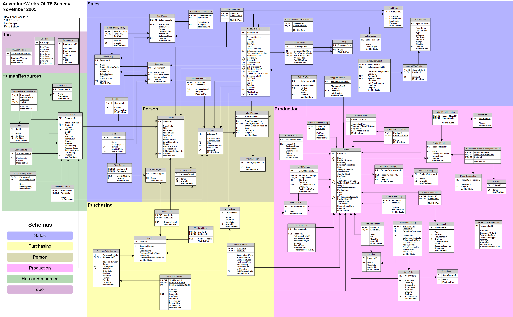

# SQL Project – Adventureworks

## Table of Contents
- [Objective](#Objective)
- [Prerequisites](#Prerequisites)
- [Database](#Database)
- [Database Diagram](#Database-Diagram)
- [Deliverables](#Deliverables)
- [Problem Statement](#Problem-Statement)
- [Solution of 1st Problem](https://github.com/Plotted-Digit/SQL-Project/tree/main/QUESTION_1)
- [Solution of 2nd Problem](https://github.com/Plotted-Digit/SQL-Project/tree/main/QUESTION_2)
- [Solution of 3rd Problem](https://github.com/Plotted-Digit/SQL-Project/tree/main/QUESTION_3)
- [Solution of 4th Problem](https://github.com/Plotted-Digit/SQL-Project/tree/main/QUESTION_4)
- [Solution of 5th Problem](https://github.com/Plotted-Digit/SQL-Project/tree/main/QUESTION_5)
- [Solution of 6th Problem](https://github.com/Plotted-Digit/SQL-Project/tree/main/QUESTION_6)
- [Solution of 7th Problem](https://github.com/Plotted-Digit/SQL-Project/tree/main/QUESTION_7)
- [Navigation](#Navigation)

## Objective
This project aims to provide you with hands-on experience in working on
a Live project for a business. It is a blend of being able to apply the SQL concepts
learnt over the course as well as understand how to interpret business case studies

## Prerequisites
The learner should have covered the following before attempting to
work on the project –
• MySQL Workbench software and the necessary databases

## Database
The database used is the Adventureworks data, which is a very good
practice dataset with multiple aspects like – Sales, Products, Employees, Territory,
Customers etc.

The database diagram is also provided for getting a better understanding of the data.

## Database Diagram

## Deliverables
The learner should prepare the following deliverables as an output
from the project –
• SQL query file with the queries used to generate the data to solve each
problem statement
• Presentation in PowerPoint or Google Slides with a Summary and showing
the data from each problem statement in a chart format
o The charts can be built directly on the slide or in Excel/Google Sheets
o Add 1 slide per problem statement with a few points on the findings
from the data and the chart depicting the output

## Problem Statement
Solve each of the following business problem statements by
writing SQL queries. The output data from the queries could be copied and used for
charts.
1. What are the top 10 highest selling products in the database?
(Hint - Use salesorderdetail as base table, LineTotal as Sales)
Create a Pie chart to depict this information.2. Who are the top 10 highest spending customers in the data along with their
address and address type information?
(Hint - Use salesorderheader as base table, TotalDue as sales)
Create a Bar chart to depict this information.
3. Calculate the Sales by Sales Reason Name and Reason Type. Also find the
best and worst performing Sales Reason in terms of Sales
(Hint - Use salesorderheader as base table, TotalDue as sales)
Create a Bar chart to depict this information.
4. Calculate the average number of orders shipped by different Ship methods for
each month and year
(Hint - Use salesorderheader as base table, TotalDue as sales)
Create a Line chart to depict this information.
5. Calculate the count of orders, maximum and minimum shipped by different
Credit Card Type for each month and year
(Hint - Use salesorderheader as base table, TotalDue as sales)
Create a chart as per your choice to depict this information.
6. Which are the top 3 highest selling Sales Person by Territory for each month
and year
(Hint - Use salesorderheader as base table, TotalDue as sales)
Create a chart as per your choice to depict this information.
7. Calculate the count of employees and average tenure per department name
and department group name.
(Hint - Use employee as base table, Tenure is calculated in days – from Hire
date to today)
Create a table to depict this information.

## Navigation

[Main Page](https://github.com/Plotted-Digit/SQL-Project/) &emsp; [1st Problem](https://github.com/Plotted-Digit/SQL-Project/tree/main/QUESTION_1) &emsp; [2nd Problem](https://github.com/Plotted-Digit/SQL-Project/tree/main/QUESTION_2) &emsp; [3rd Problem](https://github.com/Plotted-Digit/SQL-Project/tree/main/QUESTION_3) &emsp; [4th Problem](https://github.com/Plotted-Digit/SQL-Project/tree/main/QUESTION_4) &emsp; [5th Problem](https://github.com/Plotted-Digit/SQL-Project/tree/main/QUESTION_5) &emsp; [6th Problem](https://github.com/Plotted-Digit/SQL-Project/tree/main/QUESTION_6) &emsp; [7th Problem](https://github.com/Plotted-Digit/SQL-Project/tree/main/QUESTION_7)
